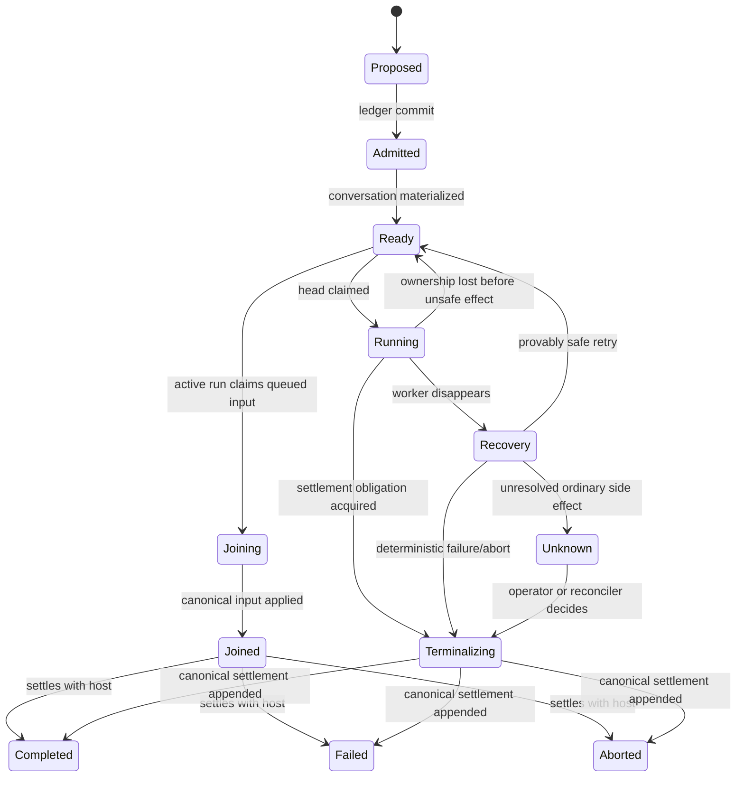

# Durability Specification

Status: Draft

This document defines the optional durable runtime. Durability is a protocol over
accepted work, canonical records, Attempt ownership, fencing, recovery, and settlement. It is
not achieved by serializing an in-memory agent object.

## 1. Contract

The durable runtime makes this promise:

> Once a submission is durably accepted, the system will eventually record exactly
> one durable terminal outcome—`completed`, `failed`, or `aborted`—unless the
> configured durability or required outcome-resolution dependencies remain unavailable.

This is an exactly-once **recording** guarantee, not an exactly-once execution
guarantee.

The runtime provides:

- durable admission before acknowledgment;
- at-least-once attempt execution;
- exactly one accepted settlement record;
- recovery after process loss;
- per-conversation ordering;
- ownership fencing against stale Attempts;
- explicit uncertainty for external side effects.

The runtime does not promise:

- exactly-once model inference;
- exactly-once execution of ordinary external tools;
- transparent replay through an unresolved side effect;
- zero duplicate provider charges;
- continuous availability when its durable store is unavailable.

## 2. Identities

All IDs are opaque, stable, and globally unique within a deployment:

- `ConversationId`
- `SubmissionId`
- `ReceiptId`
- `RunId`
- `AttemptId`
- `ToolCallId`
- `StepId`
- `SettlementId`
- `ProducerId`

Sequence numbers are conversation-local monotonic integers assigned by the durable
store. Client-supplied idempotency keys are scoped to a configured principal and
conversation.

## 3. Submission state machine

`Unknown` is nonterminal operational state. It blocks automatic continuation until
resolved. The settlement obligation remains outstanding. A deployment that permits ordinary
external effects MUST configure an authorized reconciler/operator resolution path; an unresolved
external truth is not converted to a terminal result merely to satisfy liveness.

## 4. Admission

The admission boundary is:

1. resolve the client idempotency key;
2. allocate the Submission's queue sequence;
3. insert or read the durable Submission Ledger row;
4. commit the ledger admission;
5. materialize the Conversation identity and durable attachments;
6. mark the Submission canonically ready;
7. return the Receipt.

The submitted user input is not yet part of canonical Conversation history. When the
Submission is claimed, the worker appends that input idempotently and marks it
applied before the model can consume it.

If the process stops after ledger admission but before readiness, recovery completes
materialization. A client retry with the same idempotency key resumes or returns the
same Receipt. A conflicting payload under the same key fails.

This creates an explicit accepted-but-not-ready state while keeping admission and
conversation application independently recoverable.

## 5. Per-conversation serialization

The default scheduler permits at most one active submission per conversation.
Different conversations may run concurrently.

FIFO is defined by the sequence allocated during admission, not wall-clock arrival
time. Steering addressed to an active run has a separate ordered stream but must be
committed to the canonical log before it affects the run.

An active run may claim a contiguous ready prefix of later queued Submissions:

- `joining` means the active run has claimed the queued Submission;
- after its exact canonical input is appended, it becomes `joined`;
- joined Submissions settle with the host Run;
- a crash before canonical input reverts the joining Submission to ready;
- a crash after canonical input reattaches it to the host rather than duplicating it;
- an aborted-settled queued row is a closed obligation, not a gap: the contiguous ready
  prefix walks over it (an admitted-but-not-ready row still breaks the prefix).

This join behavior comes after the base FIFO durable runtime; the ephemeral runtime
proves the same Turn-boundary semantics first.

Concurrent writers use transactional conflict detection or the platform's Conversation ownership.
An implementation may optimize storage, but observable ordering must remain the
same.

## 6. Attempt ownership and fencing

Attempt ownership is a capability of the `SubmissionLedger` service (its claim,
renewal, and release operations); the durable runtime, not the engine, depends on it.
A claim returns:

- an attempt identity;
- an ownership token;
- a monotonically increasing producer epoch where replacement is possible;
- an optional expiration/renewal requirement.

Node/SQLite may use one process owner plus a stored epoch. Cloudflare uses the
Conversation's Durable Object as the serialized owner, with attempt tokens guarding
late asynchronous work. A future distributed store could use renewable leases.

Every append and state transition carries the ownership token/epoch. The store
rejects superseded ownership atomically with the write. A stale Attempt cannot append
a late model token, Tool result, or settlement.

## 7. Canonical batches

Runtime events may be streamed live before persistence only when they are explicitly
labeled provisional. Returned text and reasoning deltas may be canonical records for audit and
exact reconstruction. Partial Tool-argument deltas remain provisional; only a complete Tool Call
becomes canonical.

A canonical batch contains:

- conversation and submission identity;
- first and last sequence;
- producer identity and epoch;
- event schema version;
- previous batch digest;
- batch digest;
- one or more ordered events;
- commit timestamp assigned by the store.

Batch append is atomic. A failed append commits no prefix. Event IDs and batch IDs
are idempotent.

## 8. Turn checkpoint boundaries

The scheduler may safely resume automatically at these boundaries:

- ready but never claimed;
- claimed but Attempt not started;
- immediately after a committed model response containing no tool requests;
- after every requested tool has a canonical result;
- after a committed compaction artifact;
- after a committed durable step result;
- after a committed model response whose declared tool batch has no prepared records yet — the
  batch resumes from the canonical declaration without re-invoking the model;
- while waiting for explicit approval, if the approval request is canonical.

The canonical approval request record is the suspension's entire canonical footprint: suspension
itself is operational ledger state, rebuildable from history, and no canonical "suspended" record
exists. The resumed Attempt appends the canonical approval decision before honoring
it.

The scheduler must classify recovery rather than blindly retry when failure occurs:

- during provider streaming before a complete canonical model item;
- after an ordinary tool may have begun but before its result commits;
- during external state mutation without an idempotency contract;
- after terminal work completed in memory but before settlement commits.

## 9. Model calls

Provider requests use a stable attempt operation ID when the provider supports it.
Provider-returned text and reasoning deltas, signatures, redaction markers, usage,
and metadata may be appended canonically as they arrive. A response becomes eligible
for Tool execution or the next Prompt only after its completion record commits.

If a worker dies mid-stream:

- already committed text/reasoning deltas remain canonical audit content but do not
  form a complete assistant turn;
- the attempt is recorded as interrupted;
- recovery may invoke the provider again;
- duplicate cost is possible and observable;
- provider affinity and request metadata are retained where allowed.

## 10. Ordinary tools

An ordinary tool is at-least-once and may have external side effects.

Before calling it, the engine commits `ToolCallPrepared` with tool identity, decoded
input digest, and tool-call ID. After it returns and output validation succeeds, the
engine commits `ToolCallSettled`.

If recovery sees `ToolCallPrepared` without `ToolCallSettled`, the outcome is
unknown unless a registered reconciliation policy can prove one of:

- execution never started;
- execution completed and its result can be recovered;
- execution is safe to repeat under a stable idempotency key.

Otherwise the run enters `Unknown` and requires operator or application resolution.
The engine must not manufacture an error result and continue.

A committed assistant response that declares application Tool Calls remains visible to recovery
of its owning Run even before every call settles. If that Run instead terminates failed or
aborted without completing the batch, a later Run MUST NOT replay the orphan assistant Tool
declaration or partial Tool results from that incomplete batch as model history. Instruction and
user messages committed before the declaration remain visible.

## 11. Durable steps

A durable step is a named, versioned unit with a stable `StepId`, Effect Schema
input/output, and application-supplied idempotency semantics.

Its guarantee is:

> at-least-once execution with exactly-once durable recording of one accepted result.

The store may return a prior result for the same step identity without executing the
body. Concurrent executions race to commit; only the fenced winning result becomes
canonical.

Only **success** is ever recorded. A failing step body fails the call into the handler's error
channel and re-entry re-executes it; recording failures would replay a transient failure forever.
Steps carry no prepared records: under an at-least-once body contract, "may have executed" is the
normal case and a prepared marker adds no recovery information. Step results persist
as canonical records in the Conversation Log under stable step identity — the Step Store of
persistence §2.5 is a logical record family, not a separate physical store.

Durable steps do not make a non-idempotent external API exactly once. The step
implementation must use the external system's idempotency key, reconciliation API,
or compensating workflow.

## 12. Terminalization

Once execution decides on `completed`, `failed`, or `aborted`, it transitions to
`terminalizing` and reserves one exact settlement record in the ledger.

Terminalization is a recoverable sequence across the separate stores:

1. reserve the settlement ID and exact record payload in the ledger;
2. append that same settlement record to canonical Conversation history;
3. finalize the ledger row as settled and release the conversation lane;
4. make later queued work eligible.

The canonical settlement record is the outcome authority. If the process stops after
step 2 but before step 3, recovery reads history and repairs the ledger. It never
rewrites history from the cached ledger status.

Each step is idempotent. Conflicting terminal outcomes are rejected. Cleanup failure
is recorded separately and cannot erase an accepted settlement.

## 13. Abort

Abort is a durable command with identity, author, reason, and target.

- If the submission is accepted but inactive, it may settle as aborted without an
  execution attempt. An aborted, never-claimed queued submission settles immediately —
  without waiting to head its lane — because settlement order of never-run work is not
  execution order (DUR-004 bounds execution order). Its durable abort intent authorizes
  exactly its aborted settlement reservation, and the aborted-settled row is a closed
  obligation that does not gap the contiguous joining prefix.
- If active, the command becomes canonical before the worker is interrupted.
- Ordinary tools already in flight may produce unknown outcomes.
- Abort does not mean external side effects were rolled back.
- Repeating the same abort command is idempotent.
- A completed or failed submission cannot later become aborted.

## 14. Recovery algorithm

A recovery worker:

1. scans or receives notification of expired/nonterminal work;
2. acquires a higher producer epoch;
3. reads the ledger, canonical log tail, checkpoints, tool records, and commands;
4. validates digests and schema versions;
5. classifies the last durable boundary;
6. either resumes, safely retries, reconciles, terminalizes, or marks unknown;
7. records the recovery decision as an audit event;
8. continues under the new fenced epoch.

Recovery policy is pure where possible and testable against a finite persisted
snapshot.

## 15. Crash-point matrix

| Crash point                                                   | Durable state                                                     | Recovery                                          |
| ------------------------------------------------------------- | ----------------------------------------------------------------- | ------------------------------------------------- |
| Before ledger admission commits                               | Nothing accepted                                                  | Client retries                                    |
| After ledger admission, before Conversation readiness         | Admitted, not ready                                               | Recovery materializes Conversation/attachments    |
| After readiness, before receipt observed                      | Ready                                                             | Idempotent retry returns same receipt             |
| After claim, before canonical input append                    | Running, input not applied                                        | Apply input idempotently                          |
| After canonical input append, before applied marker           | Input canonical                                                   | Detect exact input and repair marker              |
| After claim, before Attempt start                             | Ready/owned                                                       | Reclaim after ownership loss                      |
| Mid-provider stream                                           | Canonical partial text/reasoning may exist; no completed response | Record interruption and retry as a new response   |
| After model item commit, before tool preparation              | Model item canonical                                              | Resume tool scheduling                            |
| After tool prepared, before invocation                        | Prepared only                                                     | Retry only if proof says invocation did not start |
| During ordinary tool invocation                               | Prepared only                                                     | Reconcile or mark unknown                         |
| After tool returns, before result commit                      | Prepared only                                                     | Reconcile/idempotent retry or mark unknown        |
| After tool result commit                                      | Tool result canonical                                             | Continue next turn                                |
| After decision to finish, before terminalizing                | Nonterminal                                                       | Recompute from canonical boundary                 |
| After settlement reservation, before canonical append         | Settlement obligation                                             | Append reserved record                            |
| After canonical settlement append, before ledger finalization | Canonical terminal outcome                                        | Rebuild/finalize ledger from history              |
| After ledger finalization, before client notification         | Terminal                                                          | Return recorded settlement                        |

As of Phase 5 every row of this matrix — including the tool preparation, invocation, and
result-commit rows — is realized by executable evidence: each row exists as a pure
recovery-classifier case and as a deterministic failpoint or real process-kill test
(see the durable-runtime and crash-matrix suites).

## 16. Liveness and poison work

Retry budgets exist per operation and per submission. Exhausting a retry budget
produces either a typed terminal failure or `Unknown`, depending on side-effect
uncertainty.

Poison submissions are not retried forever. The scheduler supports:

- exponential backoff with jitter;
- maximum attempt count;
- dead-letter/operator queue;
- administrative retry after policy change;
- quarantine for corrupt records;
- alerts for overdue settlement obligations.

`Unknown` stops ordinary running-time and worker-permit consumption, but not the accepted settlement
obligation. Unknown work is aged, alerted, and routed to the configured resolution dependency.
Durable deployment claims require an operational runbook and authorized bounded intervention path
for that queue.

## 17. Requirements

- **DUR-001**: A durable Receipt is returned only after ledger admission and Conversation
  materialization/readiness are durable.
- **DUR-002**: Accepted work has exactly one durable terminal outcome.
- **DUR-003**: Execution is at least once; the product never claims universal
  exactly-once execution.
- **DUR-004**: Submission ordering is FIFO per conversation by admitted sequence.
- **DUR-005**: At most one submission is active per conversation by default.
- **DUR-006**: Every producer write is protected by platform-supplied Attempt ownership and
  fencing.
- **DUR-007**: Canonical batch append is atomic and idempotent.
- **DUR-008**: Returned text/reasoning deltas may be canonical; partial Tool-argument deltas are
  not, and no incomplete response may execute Tools.
- **DUR-009**: An unresolved ordinary tool is marked unknown and is not blindly
  replayed.
- **DUR-010**: Durable step results are exactly-once recorded, not necessarily
  exactly-once executed.
- **DUR-011**: Terminalization reserves one exact outcome, appends it canonically, then finalizes
  the ledger idempotently.
- **DUR-012**: Abort is canonical, idempotent, and cannot rewrite a prior terminal
  outcome.
- **DUR-013**: Recovery decisions are recorded and testable from persisted state.
- **DUR-014**: Retry exhaustion cannot leave accepted work silently abandoned.
- **DUR-015**: Canonical history is authoritative for applied input and terminal outcome; the
  operational ledger can be rebuilt from it.
- **DUR-016**: Recovery returns pre-append `joining` input to ready and reattaches post-append
  `joined` input without duplicate delivery.
- **DUR-017**: Unknown external outcomes remain visible accepted-work obligations, consume no
  ordinary worker permit, and require an authorized, alerted resolution dependency before a
  deployment may claim durable liveness.
